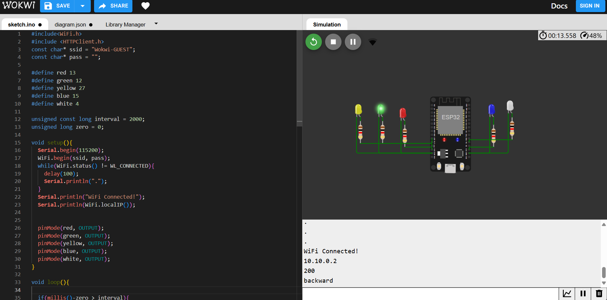

# 2nd-Task-Web

## 1- Use http request in ESP32 code to get the data from database

### [Project Page](https://wokwi.com/projects/403532315770129409)

- First, I defined each LED with its corresponding pin number
```
#define red 13
#define green 12
#define yellow 27
#define blue 15
#define white 4
```
- Second, set the pin mode for each LED to OUTPUT
```
pinMode(red, OUTPUT);
pinMode(green, OUTPUT);
pinMode(yellow, OUTPUT);
pinMode(blue, OUTPUT);
pinMode(white, OUTPUT);
```
- Third, set the conditions for each response
```
 if(payload == "forward"){
    digitalWrite(red, HIGH);
  }else if(payload == "backward"){
    digitalWrite(green, HIGH);
  }else if(payload == "stop"){
    digitalWrite(yellow, HIGH);
  }else if(payload == "right"){
    digitalWrite(blue, HIGH);
  }else if(payload == "left"){
    digitalWrite(white, HIGH);
  }
```


## 2- Build a user interface to convert voice to text
